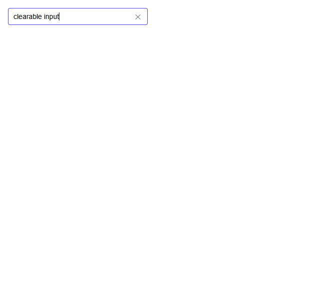
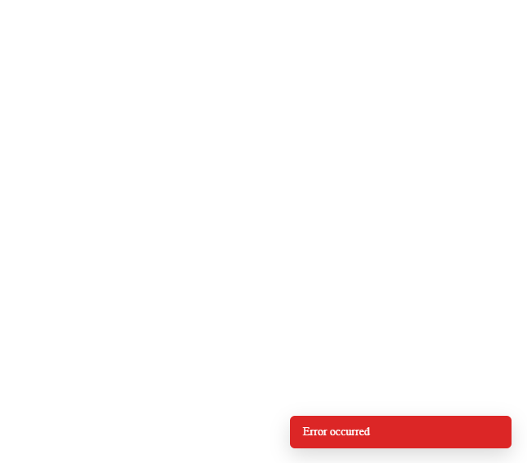
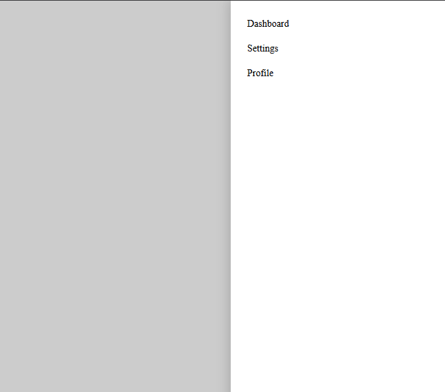
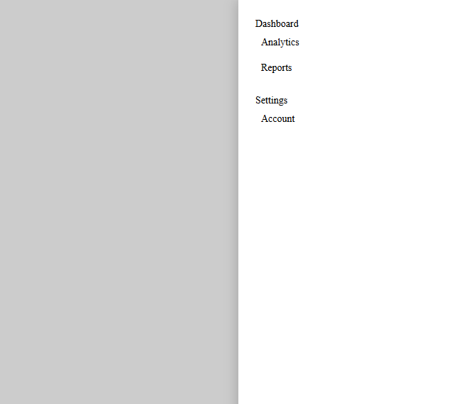

# React Component Library

A small React component library built with **Next.js**, **TypeScript**, and **Storybook**.  
Includes reusable components: `Input`, `Toast`, and `Sidebar Menu`.

---

## Project Setup

1. Clone the repository:

```bash
git clone https://github.com/VladimirRudkovskiy/book-library.git
cd book-library
npm install
npm run storybook
```


2. Input

Supports text, password, number

Clearable input with ✕ button

Password visibility toggle 👁

Props: type, value, placeholder, clearable, onChange

3. Toast

Bottom-right notification

Auto-dismiss after duration (ms)

Types: success, error, info

Props: message, type, duration, onClose

4. Sidebar Menu

Sliding panel from right

Supports nested menus (1 or 2 levels)

Closes when overlay clicked

Props: items, open, onClose


### Input Component

 
 
 
 
 
 

### Toast Component

 
 
 

### Sidebar Menu

 
 
